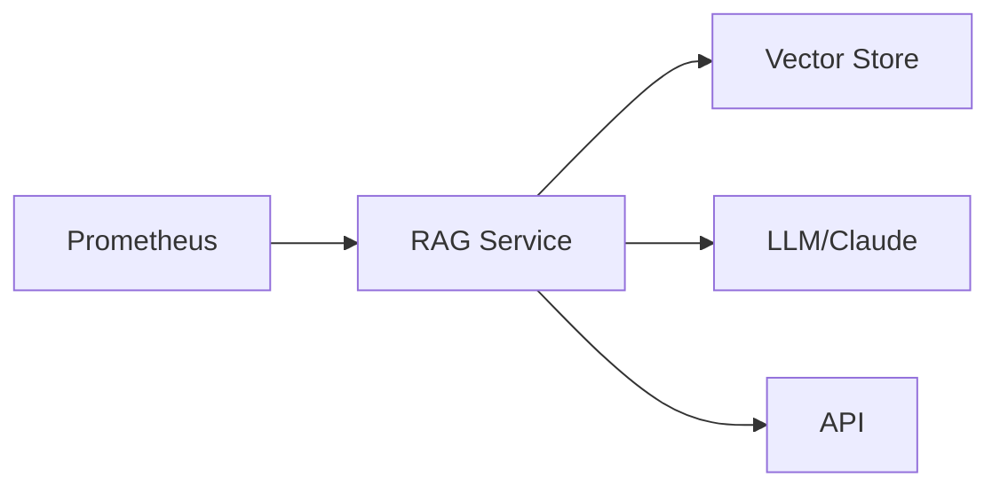

  

# Infrastructure RAG

❗❗NOTE❗❗❗
> 🤖 **AI-Driven Development**: This is an experimental project built through human-AI collaboration using GitHub Copilot and Claude 3.5 Sonnet. The code architecture, implementation decisions, and problem-solving approaches were developed through iterative AI-assisted development.
---

Real-time infrastructure analysis using RAG (Retrieval Augmented Generation) powered by Claude 3.5 Sonnet. Analyze Prometheus metrics using vector similarity search and LLM to provide insights, anomaly detection, and recommendations.

## Overview
Real-time infrastructure analysis using RAG (Retrieval Augmented Generation) powered by Claude 3.5 Sonnet. This tool analyzes Prometheus metrics using vector similarity search and LLM to provide insights and recommendations.

## Architecture


## Features
- Prometheus metrics collection and analysis
- Vector similarity search for historical patterns
- LLM-powered insights using Claude 3.5 Sonnet
- REST API with FastAPI
- Structured responses with validation
- Async support
- Comprehensive test coverage

## Prerequisites
- Python 3.11+
- Prometheus
- Node Exporter
- Anthropic API key

## Installation

```bash
# Clone repository
git clone https://github.com/yourusername/infra-rag.git
cd infra-rag

# Create virtual environment and install dependencies
make setup

# Configure environment
cp .env.example .env

```

## Configuration

Required environment variables in .env:
```
PROMETHEUS_URL=http://localhost:9090
ANTHROPIC_API_KEY=your_key_here
LLM_PROVIDER=claude
```

## Usage
### Start Server
make run

```bash
curl -X POST http://localhost:8000/analyze \
  -H "Content-Type: application/json" \
  -d '{"query": "analyze cpu usage trends"}'
```
### Example Response
```json
{
  "current_metrics": {
    "cpu_usage": {
      "value": 0.75,
      "timestamp": 1234567890
    }
  },
  "similar_patterns": {
    "historical_cpu": {
      "value": 0.70,
      "timestamp": 1234567880
    }
  },
  "analysis": {
    "summary": "CPU usage is within normal range",
    "historical_comparison": "Consistent with past patterns",
    "anomalies": [],
    "recommendations": ["Continue monitoring"],
    "risk_level": "low"
  }
}
```

## Development

```bash
# Setup project
make setup

# Run tests
make test

# Clean project
make clean
```

