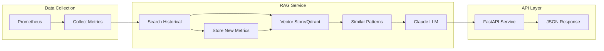

  

# Infrastructure RAG

❗❗NOTE❗❗❗
> 🤖 **AI-Driven Development**: This is an experimental project built through human-AI collaboration using GitHub Copilot and Claude 3.5 Sonnet. The code architecture, implementation decisions, and problem-solving approaches were developed through iterative AI-assisted development.
---

Real-time infrastructure analysis using RAG (Retrieval Augmented Generation) powered by Claude 3.5 Sonnet. Analyze Prometheus metrics using vector similarity search and LLM to provide insights, anomaly detection, and recommendations.

## Overview
Real-time infrastructure analysis using RAG (Retrieval Augmented Generation) powered by Claude 3.5 Sonnet. This tool analyzes Prometheus metrics using vector similarity search and LLM to provide insights and recommendations.

## Architecture


## Features
- Prometheus metrics collection and analysis
- Vector similarity search for historical patterns
- LLM-powered insights using Claude 3.5 Sonnet
- REST API with FastAPI
- Structured responses with validation
- Async support
- Comprehensive test coverage

## Prerequisites
- Python 3.11+
- Prometheus
- Node Exporter
- Anthropic API key

## Installation

```bash
# Clone repository
git clone https://github.com/yourusername/infra-rag.git
cd infra-rag

# Create virtual environment and install dependencies
make setup

# Configure environment
cp .env.example .env

```

## Configuration

Required environment variables in .env:
```
PROMETHEUS_URL=http://localhost:9090
ANTHROPIC_API_KEY=your_key_here
LLM_PROVIDER=claude
```

## Usage
### Start Server
make run

```bash
curl -X POST http://localhost:8000/analyze \
  -H "Content-Type: application/json" \
  -d '{"query": "analyze current system health"}'
```
### Example Response
```json
{
  "current_metrics": {
    "cpu_usage": {
      "value": 0.05119298245614405,
      "timestamp": 1731501942
    },
    "memory_usage": {
      "value": 1494454272.0,
      "timestamp": 1731501942
    },
    "disk_usage": {
      "value": 12325642240.0,
      "timestamp": 1731501942
    },
    "network_receive": {
      "value": 0.0,
      "timestamp": 1731501942
    },
    "network_transmit": {
      "value": 0.0,
      "timestamp": 1731501942
    }
  },
  "similar_patterns": {
    "cpu_usage": {
      "value": 0.04961368692149644,
      "timestamp": 1731501905
    },
    "disk_usage": {
      "value": 12325597184.0,
      "timestamp": 1731501905
    },
    "memory_usage": {
      "value": 1498570752.0,
      "timestamp": 1731501905
    },
    "network_receive": {
      "value": 0.0,
      "timestamp": 1731501905
    },
    "network_transmit": {
      "value": 0.0,
      "timestamp": 1731501905
    }
  },
  "analysis": {
    "summary": "[ContentBlock(text=\"Based on the provided metrics, I can analyze the current system health as follows:\\n\\n1. CPU Usage:\\n   - The current CPU usage value is 0.05119298245614405 (approximately 5.12%).\\n   - This is a relatively low CPU utilization, suggesting that the system is not experiencing significant CPU load at the moment.\\n\\n2. Memory Usage:\\n   - The current memory usage value is 1494454272.0 bytes (approximately 1.39 GB).\\n   - Without additional context about the system's total memory capacity, it's difficult to determine if this memory usage is reasonable or concerning. However, it can serve as a baseline for comparison with historical data.\\n\\n3. Disk Usage:\\n   - The current disk usage value is 12325642240.0 bytes (approximately 11.48 GB).\\n   - Similar to memory usage, the significance of this value depends on the total disk capacity and the expected disk usage for the system's workload.\\n\\n4. Network Usage:\\n   - Both network_receive and network_transmit values are 0.0, indicating no network traffic at the time of measurement.\\n   - This could be expected if the system is not actively communicating over the network or if the measurement interval is too short to capture network activity.\\n\\nOverall, based on the provided metrics, the system appears to be in a relatively healthy state with low CPU usage and no significant network activity at the time of measurement. However, without additional context about the system's resources (e.g., total memory, disk capacity) and expected workload, it's difficult to make a definitive assessment of the system's health.\\n\\nIt's recommended to compare these current metrics with historical data and established baselines or thresholds to identify any potential issues or deviations from normal behavior.\", type='text')]",
    "historical_comparison": "Analysis based on historical data",
    "anomalies": [],
    "recommendations": [],
    "risk_level": "low"
  }
}
```

## Development

```bash
# Setup project
make setup

# Run tests
make test

# Clean project
make clean
```

